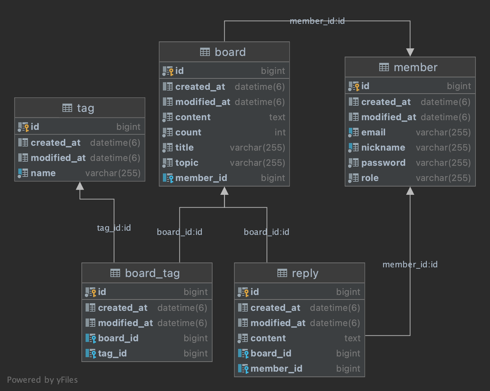
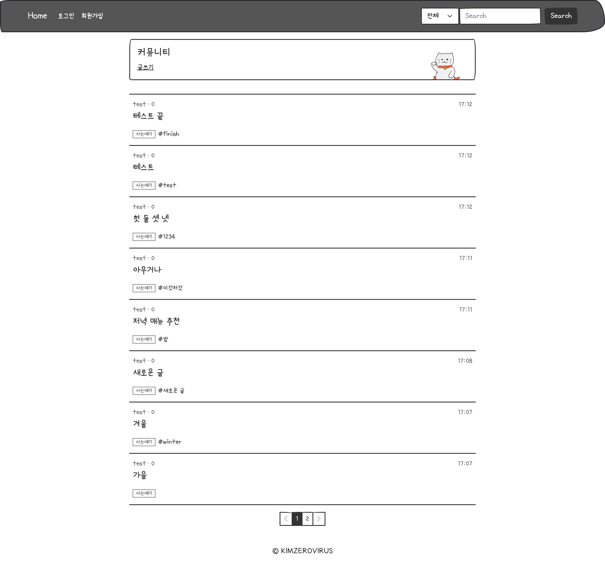
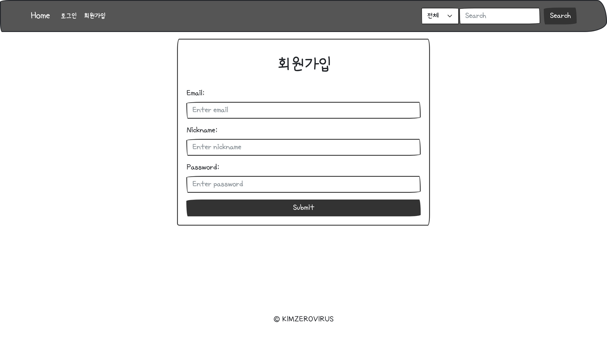
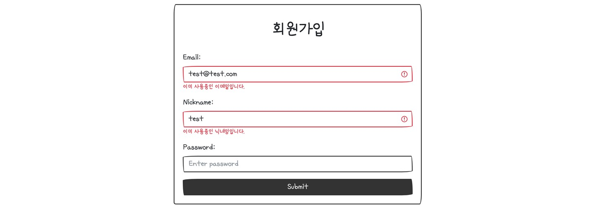
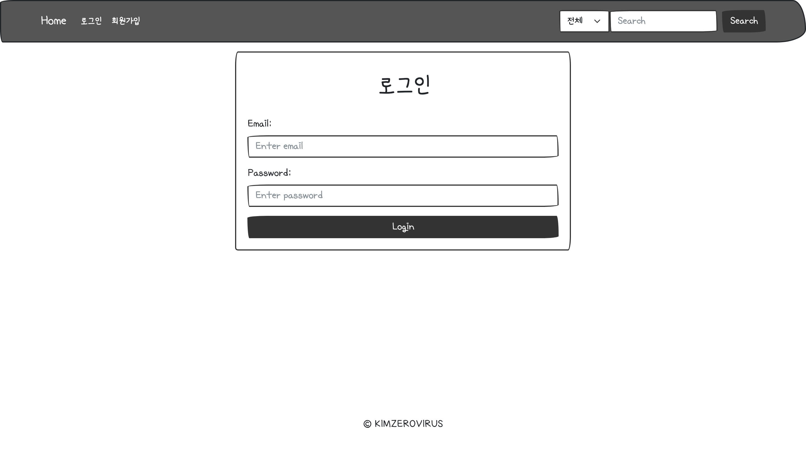
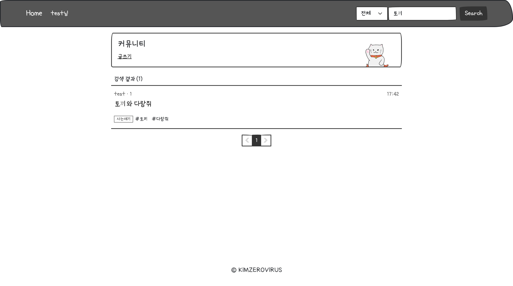
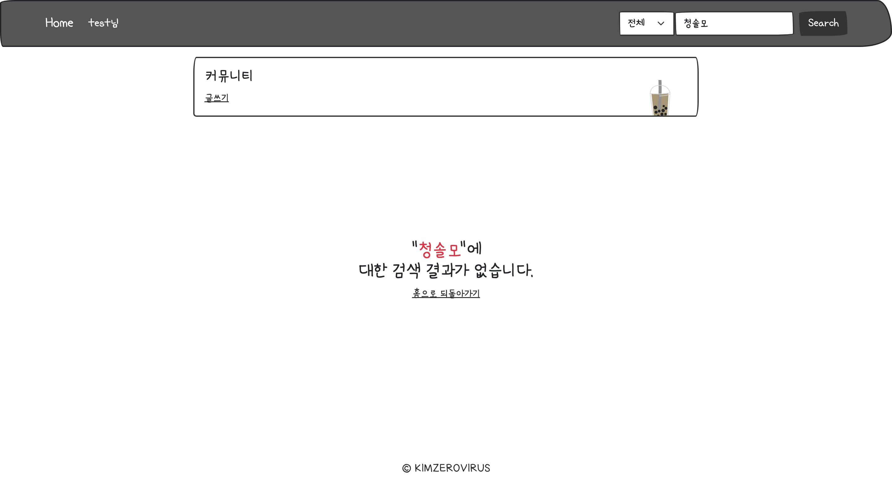
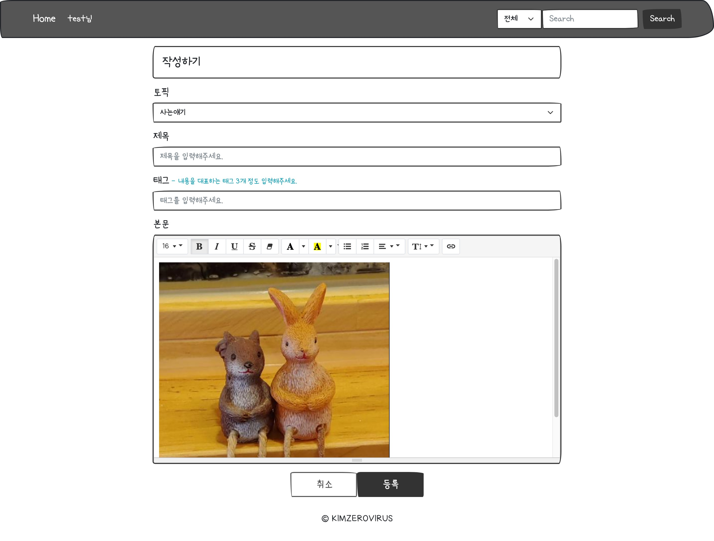
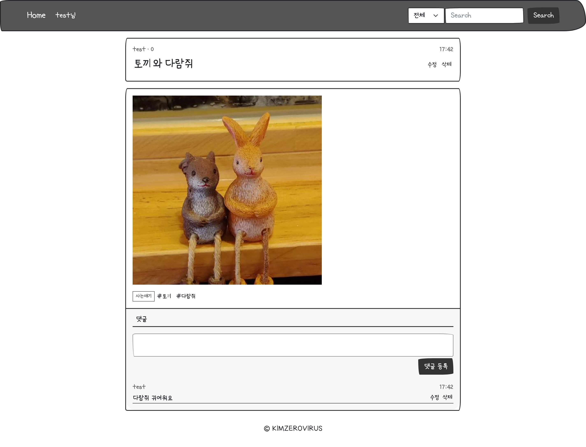
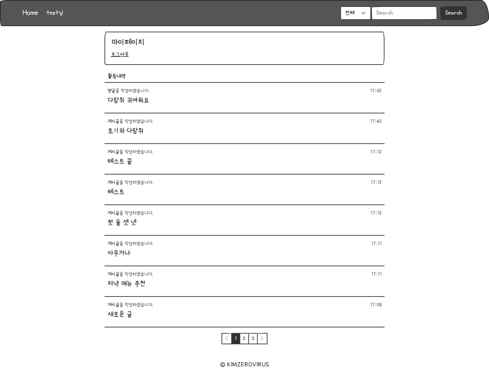

## 현재 리포지토리 이 외 활동들

**[1. 팀프로젝트 구경하러 가기](https://github.com/Chanqun-Co/carsharing)**

> 지인들과 차량 공유 플랫폼을 주제로 만든 토이프로젝트입니다. 아직 미완성이지만 페어프로그래밍 등 팀원 간의 코드리뷰를 활발히 하여 협업에 있어 많은 것을 배운 프로젝트입니다.
>
> [pull request](https://github.com/Chanqun-Co/carsharing/pulls?q=is%3Apr+is%3Aclosed)
>
> [프로젝트에서 있었던 일](https://ekgoddldi.tistory.com/281)

**[2. 개인블로그 구경하러 가기](https://github.com/kimzerovirus/kimzerovirus.github.io)**

> next.js를 학습하며 만들었던 마크다운 블로그입니다. 마크다운 파일을 읽어들이는 시스템 구현하는 부분이 조금 어려웠지만 마크다운 데이터를 들여와 제가 원하는 대로 스타일링을 적용해 화면에 띄어줄 수 있어 재밌었던 프로젝트입니다.  
>
> 현재는 정적 마크다운 사이트이므로 통계 및 관리 기능이 부족하여 티스토리 블로그를 이용 중이지만 next.js의 원리를 이해하고 학습할 수 있는 좋은 계기였습니다. 

 

 

## 📺 [프로젝트 구경하러 가기](http://ec2-3-36-35-135.ap-northeast-2.compute.amazonaws.com/)

[프로젝트 링크](http://ec2-3-36-35-135.ap-northeast-2.compute.amazonaws.com/)

테스트 계정

- 아이디: test@test.com
- 비밀번호: test1234

## 🔖 소개

그 동안 공부했던 기술들인 코틀린, 스프링 시큐리티, ORM 기술들을 가지고 혼자서 간단한 게시판 서비스를 구축하였습니다. 배포는 github action을 이용하여 S3에 업로드 후 Code Deploy를 이용하여 EC2에 배포 되도록 설정하였습니다. 주요 기능으로는 위지윅 에디터를 사용한 게시글 작성 및 이미지 업로드와 토픽, 태그 기능 등이 있습니다.

## 📚 기술스택

| 분야           | 사용 기술                       | 비고 |
| -------------- | ------------------------------- | ---- |
| FrontEnd       | Jsp, Bootstrap, summernote-editor               |      |
| BackEnd        | Kotiln, Spring Boot, Spring Security, Spring Data JPA, Querydsl |      |
| Database       | MySQL							             |      |
| Cloud Services | AWS EC2, AWS RDS, AWS S3 			 |      |
## 📋ERD

## 📄 프로젝트 페이지

### 메인화면

### 회원가입

spring boot-validation을 활용해 중복 이메일과 중복된 닉네임을 체크하여 아래 이미지와 같이 반환합니다.

### 로그인

### 글 검색

Querydsl을 활용하여 제목, 내용, 닉네임, 태그의 세분화 된 검색 기능을 제공합니다.

### 글 쓰기

summernote 위지윅 에디터를 활용하여 이미지 삽입 밑 글자 스타일 등의 설정을 할 수 있습니다.

### 글 보기

### 마이페이지

로그인한 계정의 활동내역(게시글, 댓글)을 조회할 수 있습니다.

